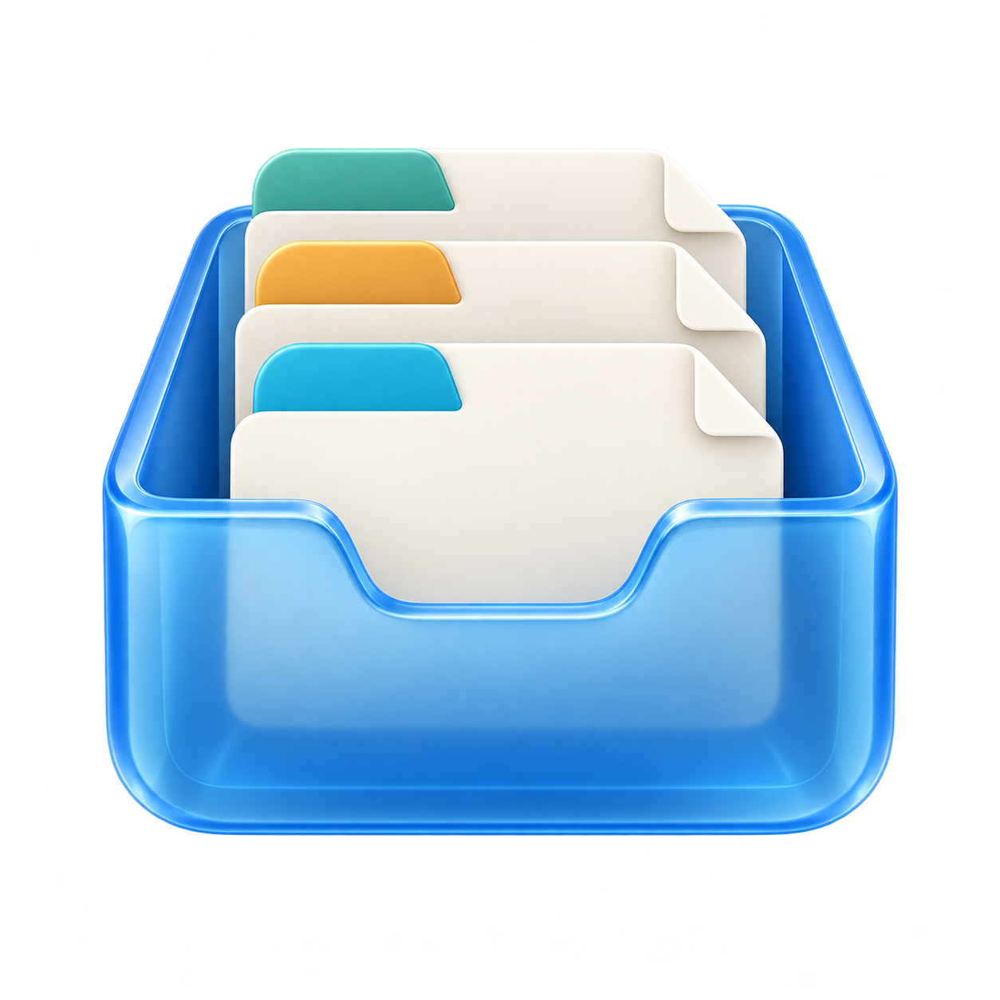
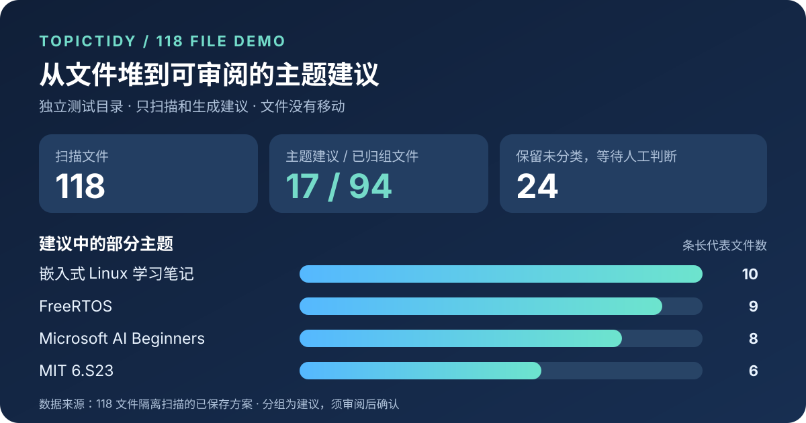
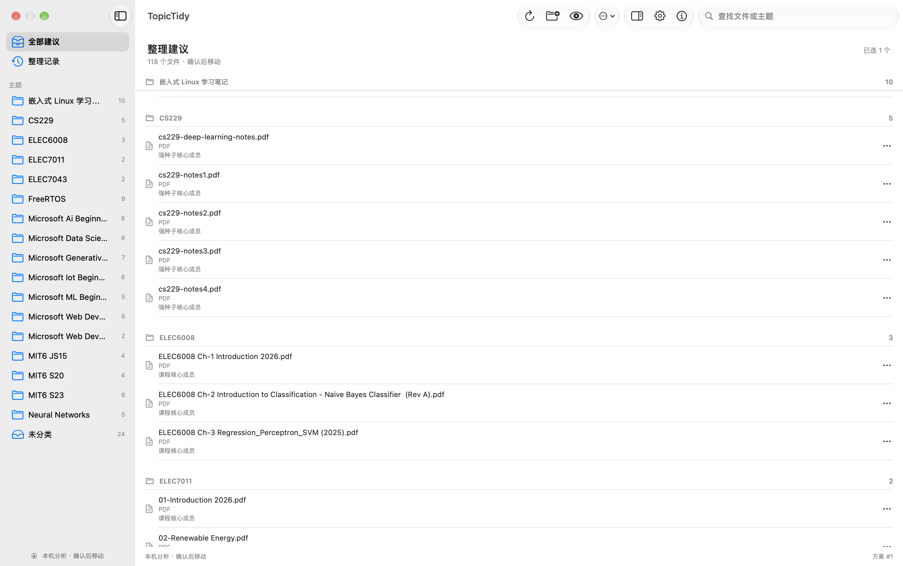
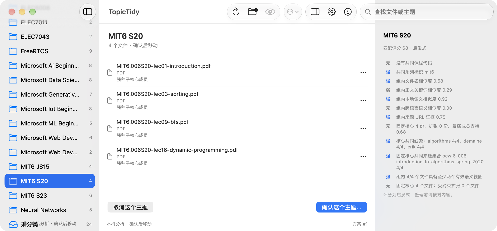

<p align="center">
  
</p>

<h1 align="center">TopicTidy</h1>

<p align="center">
  本地、可解释、可撤销的 macOS Downloads 智能整理器
</p>

<p align="center">
  
  
  
  
  
  <a href="https://github.com/YangChen-cn/TopicTidy/releases/latest"></a>
</p>

TopicTidy 把散落在下载目录里的同一课程、项目或主题文件放进一份**可审阅的整理方案**。它结合课程号、文件名、来源、正文和 Apple 本地语义能力；确认前不移动文件，整理后可以撤销。

**先扫描 → 查看分组与依据 → 按主题确认 → 随时撤销。** 默认只读、离线，自动整理默认关闭。

### 118 文件演示

以下演示使用独立测试目录中的 118 份文件，并使用全新隔离状态；只运行扫描和建议生成，**没有移动文件**。





包含真实课程课件及项目资料。不同章节的课件可以归入同一课程；依据不足的文件保留原位。评估方法和逐主题结果见 [118 文件复测](docs/REAL_WORLD_118_EVALUATION.md)。

## 特点

- 课程号、文件名、来源 URL、正文关键词与本地语义混合判断
- PDF、DOCX、PPTX、TXT 和 Markdown 文本提取
- Apple NaturalLanguage embedding；已安装语言支持可选的本地 Translation pivot
- 主题级确认、取消和撤销，不必整批接受；取消的主题进入侧栏默认折叠的“已取消”分组，下次扫描不再提出，直到手动恢复
- SQLite 保存方案、人工修正、目录关联和逐文件操作日志
- 默认离线、默认保守、绝不覆盖同名文件
- 可同时扫描多个自选文件夹，默认只扫描 `~/Downloads` 顶层
- 纯原生 Swift：同一套 `TopicTidyCore` 同时提供菜单栏 GUI 与 `tt` CLI，运行时不需要 Python、pip 或 Xcode

## 安装

适用于 Apple Silicon（arm64）和 macOS 15 或更高版本。无需安装 Python、pip 或 Xcode。

### Homebrew（推荐）

GUI + CLI：安装菜单栏应用，并把应用内的 `tt` 暴露到终端。

```bash
brew install --cask YangChen-cn/tap/topictidy
```

只装命令行（预编译 arm64 二进制，不需要 Xcode、Swift、CLT 或 Python）：

```bash
brew install --cask YangChen-cn/tap/topictidy-cli
```

> 两个 Cask 分发的都是自签名，Homebrew 下载后会带上隔离标记。
> 应用首次启动时系统会提示“未验证”，在“系统设置 → 隐私与安全性”中允许即可；
> `tt` 被系统终止时（`Killed: 9`，exit 137）执行一次：
>
> ```bash
> xattr -dr com.apple.quarantine /Applications/TopicTidy.app     # 应用内的 tt
> xattr -dr com.apple.quarantine "$(brew --prefix)/Caskroom/topictidy-cli"   # 独立 CLI
> ```
>
> 下面的 `install.sh` 直接用 curl 取件，没有这一步。

### 一键安装脚本（仅 CLI）

不需要 Homebrew：自动获取最新 Release、校验 SHA-256，安装到 `~/.local/bin/tt`，重复执行即为升级。

```bash
curl -fsSL https://raw.githubusercontent.com/YangChen-cn/TopicTidy/main/install.sh | sh
```

可用 `TOPICTIDY_VERSION=1.0.1` 指定版本，`TOPICTIDY_INSTALL_DIR` 指定安装目录。

### DMG

1. 从 [GitHub Releases](https://github.com/YangChen-cn/TopicTidy/releases/latest) 下载 `TopicTidy-1.0.1-arm64.dmg`。
2. 打开 DMG，把 TopicTidy 拖入 Applications。
3. 启动后点击菜单栏托盘图标。

当前分发包使用 `TopicTidy` 自签名证书，尚未经过 Apple Developer ID 公证。首次打开时，Gatekeeper 可能要求在“系统设置 → 隐私与安全性”中确认来源。

### 从源码

```bash
swift build -c release
.build/release/tt --help          # CLI
scripts/build_app.sh --app-only   # 生成本地 .app
open dist/TopicTidy.app
```

## CLI 快速开始

```bash
tt scan
tt propose
tt review 1
tt apply 1
tt history
tt undo 1
```

常用配置：

```bash
tt config destination ~/Documents/TopicTidy
tt config sources add ~/Documents/Courses ~/Desktop/ProjectFiles
tt config sources remove ~/Desktop/ProjectFiles
tt config sources set ~/Downloads ~/Documents/Courses
tt config show --json
tt config auto-confirm --enable --threshold 0.92
tt schedule enable --at 09:00
tt semantic status
```

`scan` 只读取各扫描文件夹的顶层普通文件，忽略子目录、符号链接、隐藏文件和未完成下载。菜单栏「设置 → 扫描文件夹」也可添加或移除目录，至少保留一个；更改扫描目录会关闭自动整理，须再次明确启用。当前版本要求扫描目录与整理目录在同一磁盘。`propose --json` 输出稳定的 `topic_id`、可编辑的 `display_name`，以及 course code、文件名、正文、native semantic、cross-language semantic、来源 URL 和组级依据的结构化证据；新增扩张会标记需要人工确认。

`apply` 会重新计算实际目标并要求确认。方案生成后已变化的文件会跳过；同名冲突使用稳定编号后缀，绝不覆盖。高置信度自动确认默认关闭，只处理完整、无排除成员、无冲突且达到阈值的主题。

## GUI

菜单栏面板可完成扫描、主题审阅、文件调整、单主题确认、历史撤销和设置。完整窗口提供原生主题侧栏、文件多选、拖入主题、空格 Quick Look 与证据视图。设置集中在一页，面板空间不足时可以滚动。

<p align="center"></p>

<p align="center"><sub>真实窗口：四份 MIT 6.006 讲义与组级依据；评分是启发式，整理前仍需核对。</sub></p>

确认前可以检查每个主题的文件和依据，也可以移动、拆分、合并或排除文件。整理操作保留确认和撤销；工具栏的 ⓘ 可查看应用信息。界面与 CLI 共用 `TopicTidyCore`，运行阶段不联网，也不依赖开发机路径。

如果旧版数据库与当前版本不兼容，应用会显示「删除旧数据库并重扫」。只有点击这个按钮后才会清除本机数据库（整理记录、人工修正和数据库中的设置）并重新扫描；下载文件不会被删除或移动。

<!-- SIZE_TABLE_START -->
| 分发物 | 迁移前（Python Core） | 迁移后（原生 Swift） | 减少 |
| --- | ---: | ---: | ---: |
| `.app` | 86.1 MiB | 5.97 MiB | 93.1% |
| `.dmg` | 43.1 MiB | 3.19 MiB | 92.6% |
<!-- SIZE_TABLE_END -->

上表由 `scripts/build_app.sh` 对同一份应用实测生成；原始字节数保存在 `dist/TopicTidy-<版本>-size-report.json`。完整的速度与等价性对比见 [docs/MIGRATION.md](docs/MIGRATION.md)。

## 工作原理

```text
已配置文件夹的顶层文件（默认 ~/Downloads）
   ↓ 扫描（只读）
课程号 / 文件名 / 来源 URL / 正文 / 本地语义
   ↓ 强种子 + 受约束扩张 + 结构化组级证据
方案（SQLite，未移动任何文件）
   ↓ 用户按主题确认
移动记录 + 关联学习
   ↓ 随时
撤销（校验指纹后恢复原位）
```

## 开发

```bash
swift build            # 构建 Core、tt、TopicTidy
swift test             # 扫描、提取、聚类、操作、自动化与 GUI 测试
.build/debug/tt benchmark            # 核心聚类基准（F1 门禁）
.build/debug/tt benchmark Resources/fixtures/holdout_unseen.json
.build/debug/tt benchmark Resources/fixtures/upgrade_development.json
.build/debug/tt benchmark Resources/fixtures/upgrade_holdout.json
scripts/build_app.sh --app-only # 本地签名 .app，供 GUI 手动验收
scripts/build_app.sh   # 用户明确要求发布时才生成签名 .app 与 DMG
scripts/package_cli.sh # 生成 CLI 压缩包
scripts/package_cli.sh --skip-build # 复用已编译的 tt 打包 CLI
scripts/generate_release_notes.sh   # 生成 Release Notes（tag 区间 commit）
scripts/publish_tap.sh --dry-run    # 渲染 Homebrew tap（不推送）
```

发布：打 `v*` 标签即触发 `.github/workflows/release.yml`——校验 tag 与版本、导入签名证书（缺失即失败）、跑测试与基准、**只编译一次** release 二进制（App 与 CLI 复用）、生成 Release Notes 与 `SHA256SUMS.txt`、创建 GitHub Release，最后用 `scripts/publish_tap.sh` 把 Homebrew tap 更新到该版本。普通分支推送只触发 `tests.yml`，`v*` 标签不会再重复跑一遍 Tests。

测试与基准必须使用临时 Downloads 目录，绝不指向真实的 `~/Downloads`。

## 文档

- [docs/ARCHITECTURE.md](docs/ARCHITECTURE.md) — 模块职责与核心不变量
- [docs/MIGRATION.md](docs/MIGRATION.md) — Python → Swift 迁移的等价性证据与实测对比
- [docs/HOLDOUT_EVALUATION.md](docs/HOLDOUT_EVALUATION.md) — 留出语料评估
- [docs/REAL_WORLD_EVALUATION.md](docs/REAL_WORLD_EVALUATION.md) — 真实语料评估
- [docs/REAL_WORLD_110_EVALUATION.md](docs/REAL_WORLD_110_EVALUATION.md) — 扩充到 110 文件后的 Swift 复测
